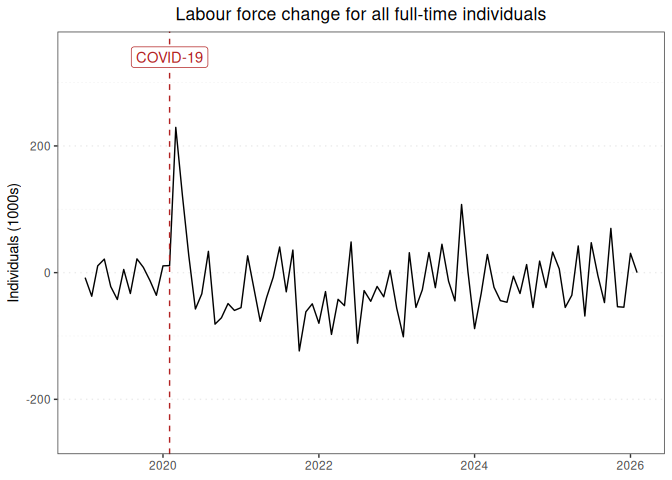

Labour force report for all full-time individuals
================

### Graph of labour force changes since 2019

This report displays the adjusted monthly change in labour force numbers
for all full-time individuals from 2019-01 to 2023-07.

<!-- -->

### Table of labour force numbers and changes in the last 12 months

This table displays the adjusted labour force numbers and adjusted
change in labour force numbers for all full-time individuals from
2022-09 to 2023-07.

| year | month |   number | ingested_on |    change |
|-----:|------:|---------:|:------------|----------:|
| 2022 |     9 | 9552.499 | 2023-09-01  | -43.16238 |
| 2022 |    10 | 9595.661 | 2023-09-01  | -25.90801 |
| 2022 |    11 | 9621.569 | 2023-09-01  | -29.14140 |
| 2022 |    12 | 9650.711 | 2023-09-01  |  21.12178 |
| 2023 |     1 | 9629.589 | 2023-09-01  | -74.01224 |
| 2023 |     2 | 9703.601 | 2023-09-01  | -89.10680 |
| 2023 |     3 | 9792.708 | 2023-09-01  |  29.15894 |
| 2023 |     4 | 9763.549 | 2023-09-01  | -62.48005 |
| 2023 |     5 | 9826.029 | 2023-09-01  | -37.99616 |
| 2023 |     6 | 9864.025 | 2023-09-01  |  24.23870 |
| 2023 |     7 | 9839.787 | 2023-09-01  |   0.00000 |

------------------------------------------------------------------------

Report last updated on 2023-09-01 from the [ABS labour force
dataset](https://www.abs.gov.au/statistics/labour/employment-and-unemployment/labour-force-australia/latest-release)
