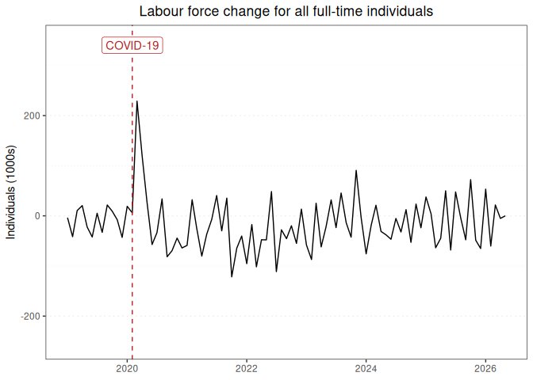

Labour force report for all full-time individuals
================

### Graph of labour force changes since 2019

This report displays the adjusted monthly change in labour force numbers
for all full-time individuals from 2019-01 to 2026-02.

<!-- -->

### Table of labour force numbers and changes in the last 12 months

This table displays the adjusted labour force numbers and adjusted
change in labour force numbers for all full-time individuals from
2025-04 to 2026-02.

| year | month |   number | ingested_on |     change |
|-----:|------:|---------:|:------------|-----------:|
| 2025 |     4 | 10042.32 | 2026-04-01  | -35.627762 |
| 2025 |     5 | 10077.95 | 2026-04-01  |  42.121176 |
| 2025 |     6 | 10035.82 | 2026-04-01  | -68.476143 |
| 2025 |     7 | 10104.30 | 2026-04-01  |  47.224725 |
| 2025 |     8 | 10057.08 | 2026-04-01  |  -4.506207 |
| 2025 |     9 | 10061.58 | 2026-04-01  | -47.281811 |
| 2025 |    10 | 10108.86 | 2026-04-01  |  69.829312 |
| 2025 |    11 | 10039.03 | 2026-04-01  | -53.829364 |
| 2025 |    12 | 10092.86 | 2026-04-01  | -54.567358 |
| 2026 |     1 | 10147.43 | 2026-04-01  |  30.479478 |
| 2026 |     2 | 10116.95 | 2026-04-01  |   0.000000 |

------------------------------------------------------------------------

Report last updated on 2026-04-01 from the [ABS labour force
dataset](https://www.abs.gov.au/statistics/labour/employment-and-unemployment/labour-force-australia/latest-release)
