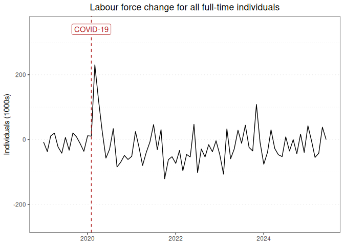

Labour force report for all full-time individuals
================

### Graph of labour force changes since 2019

This report displays the adjusted monthly change in labour force numbers
for all full-time individuals from 2019-01 to 2025-05.

<!-- -->

### Table of labour force numbers and changes in the last 12 months

This table displays the adjusted labour force numbers and adjusted
change in labour force numbers for all full-time individuals from
2024-07 to 2025-05.

| year | month |    number | ingested_on |      change |
|-----:|------:|----------:|:------------|------------:|
| 2024 |     7 |  9945.139 | 2025-07-01  |   5.7377052 |
| 2024 |     8 |  9939.402 | 2025-07-01  | -35.4911559 |
| 2024 |     9 |  9974.893 | 2025-07-01  |   0.3058451 |
| 2024 |    10 |  9974.587 | 2025-07-01  | -44.0672902 |
| 2024 |    11 | 10018.654 | 2025-07-01  |  16.6511244 |
| 2024 |    12 | 10002.003 | 2025-07-01  | -39.9185878 |
| 2025 |     1 | 10041.922 | 2025-07-01  |  41.4148522 |
| 2025 |     2 | 10000.507 | 2025-07-01  |  -6.0959500 |
| 2025 |     3 | 10006.603 | 2025-07-01  | -58.6215496 |
| 2025 |     4 | 10065.224 | 2025-07-01  | -38.6922499 |
| 2025 |     5 | 10103.917 | 2025-07-01  |   0.0000000 |

------------------------------------------------------------------------

Report last updated on 2025-07-01 from the [ABS labour force
dataset](https://www.abs.gov.au/statistics/labour/employment-and-unemployment/labour-force-australia/latest-release)
