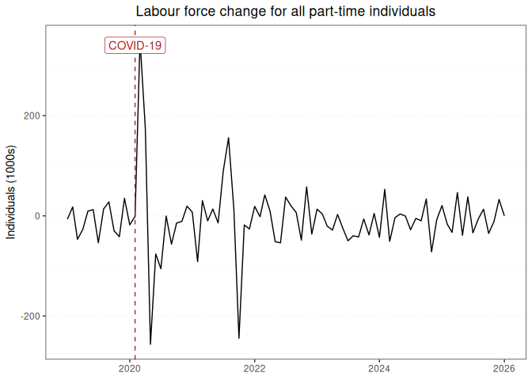

Labour force report for all part-time individuals
================

### Graph of labour force changes since 2019

This report displays the adjusted monthly change in labour force numbers
for all part-time individuals from 2019-01 to 2024-01.

<!-- -->

### Table of labour force numbers and changes in the last 12 months

This table displays the adjusted labour force numbers and adjusted
change in labour force numbers for all part-time individuals from
2023-03 to 2024-01.

| year | month |   number | ingested_on |     change |
|-----:|------:|---------:|:------------|-----------:|
| 2023 |     3 | 4145.729 | 2024-03-01  | -27.634982 |
| 2023 |     4 | 4173.364 | 2024-03-01  | -16.607999 |
| 2023 |     5 | 4189.972 | 2024-03-01  |   2.438002 |
| 2023 |     6 | 4187.534 | 2024-03-01  | -21.314950 |
| 2023 |     7 | 4208.849 | 2024-03-01  | -59.576032 |
| 2023 |     8 | 4268.425 | 2024-03-01  | -48.059584 |
| 2023 |     9 | 4316.485 | 2024-03-01  | -35.679823 |
| 2023 |    10 | 4352.164 | 2024-03-01  | -15.256810 |
| 2023 |    11 | 4367.421 | 2024-03-01  | -46.687561 |
| 2023 |    12 | 4414.109 | 2024-03-01  |  10.578370 |
| 2024 |     1 | 4403.530 | 2024-03-01  |   0.000000 |

------------------------------------------------------------------------

Report last updated on 2024-03-01 from the [ABS labour force
dataset](https://www.abs.gov.au/statistics/labour/employment-and-unemployment/labour-force-australia/latest-release)
