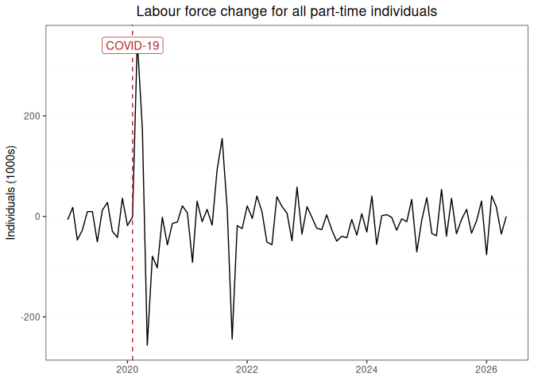

Labour force report for all part-time individuals
================

### Graph of labour force changes since 2019

This report displays the adjusted monthly change in labour force numbers
for all part-time individuals from 2019-01 to 2026-02.

<!-- -->

### Table of labour force numbers and changes in the last 12 months

This table displays the adjusted labour force numbers and adjusted
change in labour force numbers for all part-time individuals from
2025-04 to 2026-02.

| year | month |   number | ingested_on |     change |
|-----:|------:|---------:|:------------|-----------:|
| 2025 |     4 | 4551.418 | 2026-04-01  |  46.498270 |
| 2025 |     5 | 4504.920 | 2026-04-01  | -38.181260 |
| 2025 |     6 | 4543.101 | 2026-04-01  |  34.345002 |
| 2025 |     7 | 4508.756 | 2026-04-01  | -33.359254 |
| 2025 |     8 | 4542.115 | 2026-04-01  |  -7.535629 |
| 2025 |     9 | 4549.651 | 2026-04-01  |  13.684589 |
| 2025 |    10 | 4535.967 | 2026-04-01  | -34.798069 |
| 2025 |    11 | 4570.765 | 2026-04-01  | -10.128385 |
| 2025 |    12 | 4580.893 | 2026-04-01  |  28.512808 |
| 2026 |     1 | 4552.380 | 2026-04-01  | -79.412541 |
| 2026 |     2 | 4631.793 | 2026-04-01  |   0.000000 |

------------------------------------------------------------------------

Report last updated on 2026-04-01 from the [ABS labour force
dataset](https://www.abs.gov.au/statistics/labour/employment-and-unemployment/labour-force-australia/latest-release)
