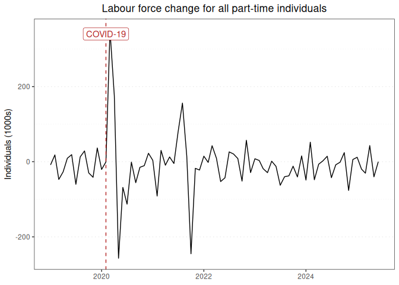

Labour force report for all part-time individuals
================

### Graph of labour force changes since 2019

This report displays the adjusted monthly change in labour force numbers
for all part-time individuals from 2019-01 to 2023-10.

<!-- -->

### Table of labour force numbers and changes in the last 12 months

This table displays the adjusted labour force numbers and adjusted
change in labour force numbers for all part-time individuals from
2022-12 to 2023-10.

| year | month |   number | ingested_on |     change |
|-----:|------:|---------:|:------------|-----------:|
| 2022 |    12 | 4141.279 | 2023-12-01  | -37.248639 |
| 2023 |     1 | 4178.527 | 2023-12-01  |  14.398246 |
| 2023 |     2 | 4164.129 | 2023-12-01  |  17.680112 |
| 2023 |     3 | 4146.449 | 2023-12-01  | -25.199590 |
| 2023 |     4 | 4171.649 | 2023-12-01  | -16.066585 |
| 2023 |     5 | 4187.715 | 2023-12-01  |   3.742487 |
| 2023 |     6 | 4183.973 | 2023-12-01  | -20.294701 |
| 2023 |     7 | 4204.267 | 2023-12-01  | -58.990643 |
| 2023 |     8 | 4263.258 | 2023-12-01  | -44.328741 |
| 2023 |     9 | 4307.587 | 2023-12-01  | -37.946508 |
| 2023 |    10 | 4345.533 | 2023-12-01  |   0.000000 |

------------------------------------------------------------------------

Report last updated on 2023-12-01 from the [ABS labour force
dataset](https://www.abs.gov.au/statistics/labour/employment-and-unemployment/labour-force-australia/latest-release)
