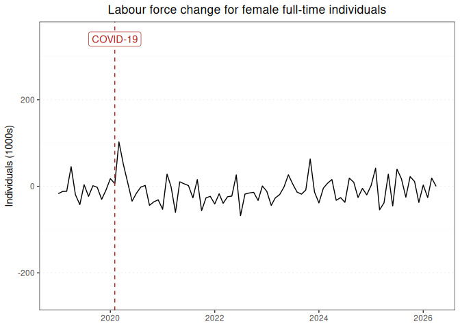

Labour force report for female full-time individuals
================

### Graph of labour force changes since 2019

This report displays the adjusted monthly change in labour force numbers
for female full-time individuals from 2019-01 to 2026-01.

<!-- -->

### Table of labour force numbers and changes in the last 12 months

This table displays the adjusted labour force numbers and adjusted
change in labour force numbers for female full-time individuals from
2025-03 to 2026-01.

| year | month |   number | ingested_on |     change |
|-----:|------:|---------:|:------------|-----------:|
| 2025 |     3 | 3934.265 | 2026-03-01  | -44.639886 |
| 2025 |     4 | 3978.905 | 2026-03-01  | -39.751638 |
| 2025 |     5 | 4018.657 | 2026-03-01  |  26.588164 |
| 2025 |     6 | 3992.069 | 2026-03-01  | -46.001029 |
| 2025 |     7 | 4038.070 | 2026-03-01  |  39.053259 |
| 2025 |     8 | 3999.016 | 2026-03-01  |  17.267670 |
| 2025 |     9 | 3981.749 | 2026-03-01  | -26.275491 |
| 2025 |    10 | 4008.024 | 2026-03-01  |  19.801039 |
| 2025 |    11 | 3988.223 | 2026-03-01  |   6.975009 |
| 2025 |    12 | 3981.248 | 2026-03-01  | -28.840493 |
| 2026 |     1 | 4010.089 | 2026-03-01  |   0.000000 |

------------------------------------------------------------------------

Report last updated on 2026-03-01 from the [ABS labour force
dataset](https://www.abs.gov.au/statistics/labour/employment-and-unemployment/labour-force-australia/latest-release)
