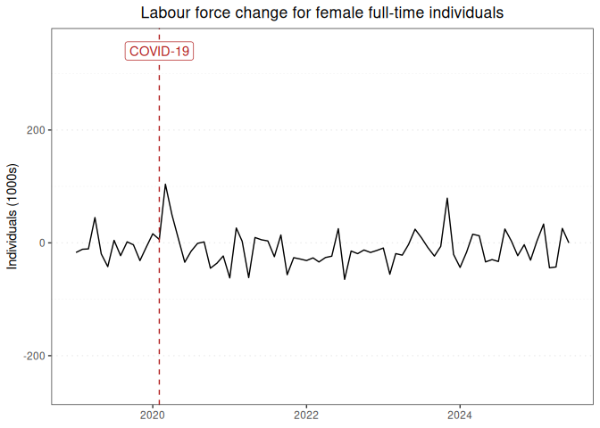

Labour force report for female full-time individuals
================

### Graph of labour force changes since 2019

This report displays the adjusted monthly change in labour force numbers
for female full-time individuals from 2019-01 to 2025-07.

<!-- -->

### Table of labour force numbers and changes in the last 12 months

This table displays the adjusted labour force numbers and adjusted
change in labour force numbers for female full-time individuals from
2024-09 to 2025-07.

| year | month |   number | ingested_on |     change |
|-----:|------:|---------:|:------------|-----------:|
| 2024 |     9 | 3927.392 | 2025-09-01  |   2.611974 |
| 2024 |    10 | 3924.780 | 2025-08-01  | -22.762173 |
| 2024 |    11 | 3947.543 | 2025-09-01  |  -3.381493 |
| 2024 |    12 | 3950.924 | 2025-09-01  | -30.852347 |
| 2025 |     1 | 3981.776 | 2025-09-01  |   3.329493 |
| 2025 |     2 | 3978.447 | 2025-09-01  |  33.127837 |
| 2025 |     3 | 3945.319 | 2025-09-01  | -45.131302 |
| 2025 |     4 | 3990.450 | 2025-09-01  | -40.557575 |
| 2025 |     5 | 4031.008 | 2025-09-01  |  22.237469 |
| 2025 |     6 | 4008.771 | 2025-09-01  | -40.067486 |
| 2025 |     7 | 4048.838 | 2025-09-01  |   0.000000 |

------------------------------------------------------------------------

Report last updated on 2025-09-01 from the [ABS labour force
dataset](https://www.abs.gov.au/statistics/labour/employment-and-unemployment/labour-force-australia/latest-release)
