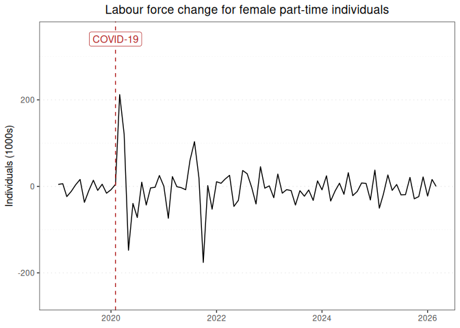

Labour force report for female part-time individuals
================

### Graph of labour force changes since 2019

This report displays the adjusted monthly change in labour force numbers
for female part-time individuals from 2019-01 to 2026-01.

<!-- -->

### Table of labour force numbers and changes in the last 12 months

This table displays the adjusted labour force numbers and adjusted
change in labour force numbers for female part-time individuals from
2025-03 to 2026-01.

| year | month |   number | ingested_on |     change |
|-----:|------:|---------:|:------------|-----------:|
| 2025 |     3 | 2999.499 | 2026-03-01  | -29.497192 |
| 2025 |     4 | 3028.997 | 2026-03-01  |  29.452900 |
| 2025 |     5 | 2999.544 | 2026-03-01  |  -9.236344 |
| 2025 |     6 | 3008.780 | 2026-03-01  |   4.232308 |
| 2025 |     7 | 3004.548 | 2026-03-01  | -18.654990 |
| 2025 |     8 | 3023.203 | 2026-03-01  | -20.104199 |
| 2025 |     9 | 3043.307 | 2026-03-01  |  20.173349 |
| 2025 |    10 | 3023.134 | 2026-03-01  | -29.798616 |
| 2025 |    11 | 3052.932 | 2026-03-01  | -26.661935 |
| 2025 |    12 | 3079.594 | 2026-03-01  |  25.721642 |
| 2026 |     1 | 3053.872 | 2026-03-01  |   0.000000 |

------------------------------------------------------------------------

Report last updated on 2026-03-01 from the [ABS labour force
dataset](https://www.abs.gov.au/statistics/labour/employment-and-unemployment/labour-force-australia/latest-release)
