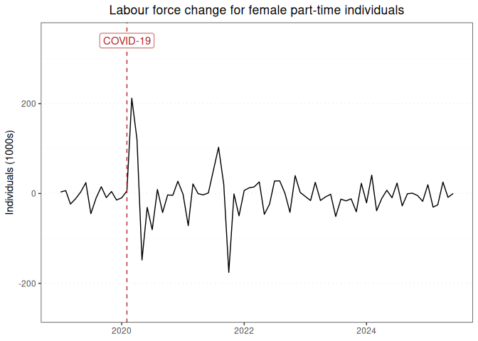

Labour force report for female part-time individuals
================

### Graph of labour force changes since 2019

This report displays the adjusted monthly change in labour force numbers
for female part-time individuals from 2019-01 to 2024-06.

<!-- -->

### Table of labour force numbers and changes in the last 12 months

This table displays the adjusted labour force numbers and adjusted
change in labour force numbers for female part-time individuals from
2023-08 to 2024-06.

| year | month |   number | ingested_on |     change |
|-----:|------:|---------:|:------------|-----------:|
| 2023 |     8 | 2871.730 | 2024-08-01  | -21.120467 |
| 2023 |     9 | 2892.850 | 2024-08-01  | -16.664587 |
| 2023 |    10 | 2909.515 | 2024-08-01  | -10.519571 |
| 2023 |    11 | 2920.034 | 2024-08-01  | -46.713054 |
| 2023 |    12 | 2966.747 | 2024-08-01  |  18.926968 |
| 2024 |     1 | 2947.820 | 2024-08-01  | -10.991340 |
| 2024 |     2 | 2958.812 | 2024-08-01  |  17.422182 |
| 2024 |     3 | 2941.389 | 2024-08-01  | -35.848869 |
| 2024 |     4 | 2977.238 | 2024-08-01  |  -1.450144 |
| 2024 |     5 | 2978.688 | 2024-08-01  |   4.473616 |
| 2024 |     6 | 2974.215 | 2024-08-01  |   0.000000 |

------------------------------------------------------------------------

Report last updated on 2024-08-01 from the [ABS labour force
dataset](https://www.abs.gov.au/statistics/labour/employment-and-unemployment/labour-force-australia/latest-release)
