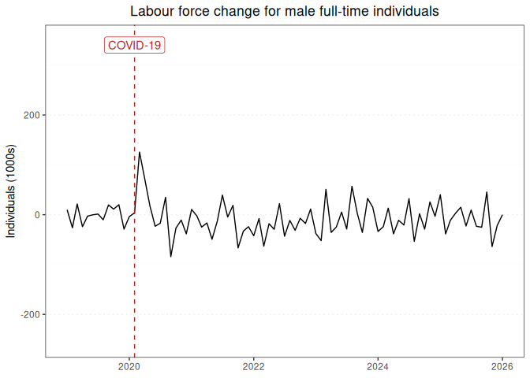

Labour force report for male full-time individuals
================

### Graph of labour force changes since 2019

This report displays the adjusted monthly change in labour force numbers
for male full-time individuals from 2019-01 to 2024-09.

<!-- -->

### Table of labour force numbers and changes in the last 12 months

This table displays the adjusted labour force numbers and adjusted
change in labour force numbers for male full-time individuals from
2023-11 to 2024-09.

| year | month |   number | ingested_on |     change |
|-----:|------:|---------:|:------------|-----------:|
| 2023 |    11 | 5959.627 | 2024-11-01  |  29.524597 |
| 2023 |    12 | 5930.102 | 2024-11-01  |  15.771691 |
| 2024 |     1 | 5914.330 | 2024-11-01  | -31.712669 |
| 2024 |     2 | 5946.043 | 2024-11-01  | -21.946928 |
| 2024 |     3 | 5967.990 | 2024-11-01  |   4.818782 |
| 2024 |     4 | 5963.171 | 2024-11-01  | -41.143735 |
| 2024 |     5 | 6004.315 | 2024-11-01  | -13.894546 |
| 2024 |     6 | 6018.210 | 2024-11-01  | -28.183173 |
| 2024 |     7 | 6046.393 | 2024-11-01  |  33.739401 |
| 2024 |     8 | 6012.653 | 2024-11-01  | -63.550770 |
| 2024 |     9 | 6076.204 | 2024-11-01  |   0.000000 |

------------------------------------------------------------------------

Report last updated on 2024-11-01 from the [ABS labour force
dataset](https://www.abs.gov.au/statistics/labour/employment-and-unemployment/labour-force-australia/latest-release)
