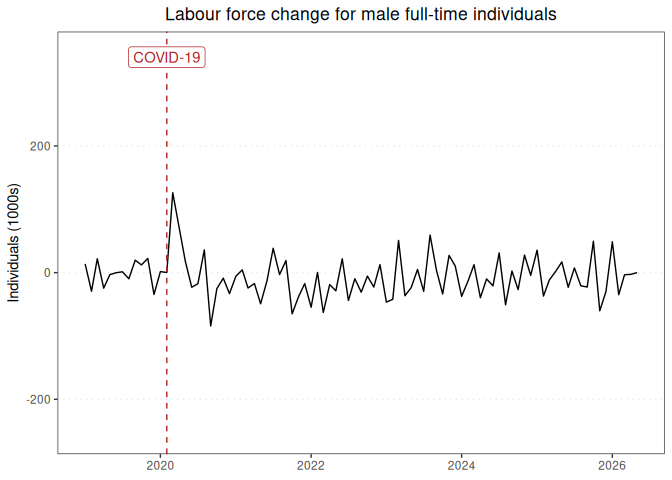

Labour force report for male full-time individuals
================

### Graph of labour force changes since 2019

This report displays the adjusted monthly change in labour force numbers
for male full-time individuals from 2019-01 to 2026-02.

<!-- -->

### Table of labour force numbers and changes in the last 12 months

This table displays the adjusted labour force numbers and adjusted
change in labour force numbers for male full-time individuals from
2025-04 to 2026-02.

| year | month |   number | ingested_on |     change |
|-----:|------:|---------:|:------------|-----------:|
| 2025 |     4 | 6062.713 | 2026-04-01  |   3.781092 |
| 2025 |     5 | 6058.932 | 2026-04-01  |  15.502061 |
| 2025 |     6 | 6043.430 | 2026-04-01  | -22.688458 |
| 2025 |     7 | 6066.118 | 2026-04-01  |   7.613179 |
| 2025 |     8 | 6058.505 | 2026-04-01  | -21.763011 |
| 2025 |     9 | 6080.268 | 2026-04-01  | -22.305847 |
| 2025 |    10 | 6102.574 | 2026-04-01  |  48.801918 |
| 2025 |    11 | 6053.772 | 2026-04-01  | -62.138118 |
| 2025 |    12 | 6115.910 | 2026-04-01  | -24.159819 |
| 2026 |     1 | 6140.070 | 2026-04-01  |  34.528483 |
| 2026 |     2 | 6105.542 | 2026-04-01  |   0.000000 |

------------------------------------------------------------------------

Report last updated on 2026-04-01 from the [ABS labour force
dataset](https://www.abs.gov.au/statistics/labour/employment-and-unemployment/labour-force-australia/latest-release)
