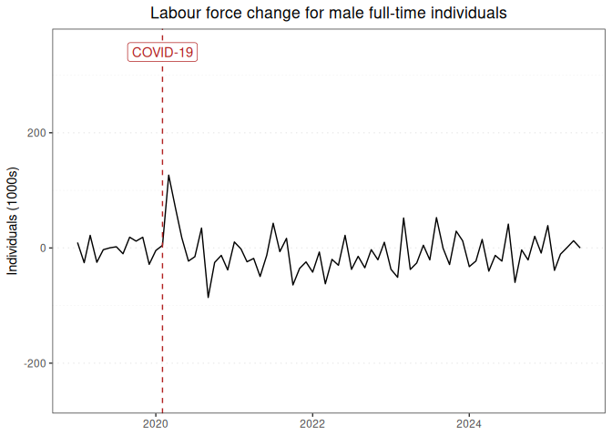

Labour force report for male full-time individuals
================

### Graph of labour force changes since 2019

This report displays the adjusted monthly change in labour force numbers
for male full-time individuals from 2019-01 to 2022-05.

<!-- -->

### Table of labour force numbers and changes in the last 12 months

This table displays the adjusted labour force numbers and adjusted
change in labour force numbers for male full-time individuals from
2021-07 to 2022-05.

| year | month |   number | ingested_on |     change |
|-----:|------:|---------:|:------------|-----------:|
| 2021 |     7 | 5588.712 | 2022-07-01  |  47.152836 |
| 2021 |     8 | 5541.559 | 2022-07-01  |   7.446501 |
| 2021 |     9 | 5534.113 | 2022-07-01  |  13.749250 |
| 2021 |    10 | 5520.364 | 2022-07-01  | -89.575977 |
| 2021 |    11 | 5609.939 | 2022-07-01  | -32.489253 |
| 2021 |    12 | 5642.429 | 2022-07-01  |  10.743170 |
| 2022 |     1 | 5631.686 | 2022-07-01  | -47.120085 |
| 2022 |     2 | 5678.806 | 2022-07-01  | -12.447213 |
| 2022 |     3 | 5691.253 | 2022-07-01  | -58.189987 |
| 2022 |     4 | 5749.443 | 2022-07-01  | -35.168206 |
| 2022 |     5 | 5784.611 | 2022-07-01  |   0.000000 |

------------------------------------------------------------------------

Report last updated on 2022-07-01 from the [ABS labour force
dataset](https://www.abs.gov.au/statistics/labour/employment-and-unemployment/labour-force-australia/latest-release)
