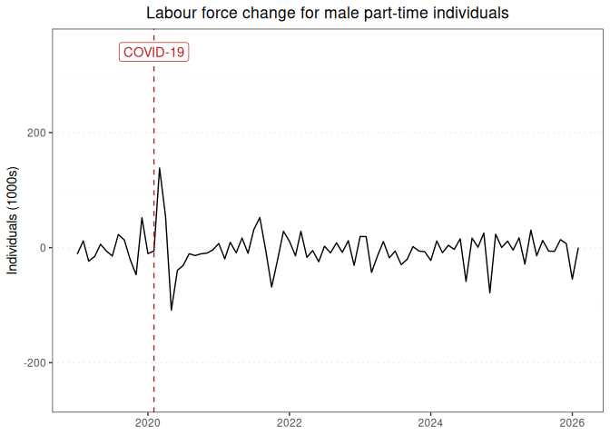

Labour force report for male part-time individuals
================

### Graph of labour force changes since 2019

This report displays the adjusted monthly change in labour force numbers
for male part-time individuals from 2019-01 to 2025-08.

<!-- -->

### Table of labour force numbers and changes in the last 12 months

This table displays the adjusted labour force numbers and adjusted
change in labour force numbers for male part-time individuals from
2024-10 to 2025-08.

| year | month |   number | ingested_on |     change |
|-----:|------:|---------:|:------------|-----------:|
| 2024 |    10 | 1500.619 | 2025-10-01  |  23.750863 |
| 2024 |    11 | 1476.868 | 2025-10-01  | -71.143199 |
| 2024 |    12 | 1548.011 | 2025-10-01  |  23.667620 |
| 2025 |     1 | 1524.344 | 2025-10-01  |  -6.717478 |
| 2025 |     2 | 1531.061 | 2025-10-01  |  11.146505 |
| 2025 |     3 | 1519.915 | 2025-10-01  |  -4.500489 |
| 2025 |     4 | 1524.415 | 2025-10-01  |  15.759545 |
| 2025 |     5 | 1508.655 | 2025-10-01  | -30.398768 |
| 2025 |     6 | 1539.054 | 2025-10-01  |  32.339220 |
| 2025 |     7 | 1506.715 | 2025-10-01  | -17.356834 |
| 2025 |     8 | 1524.072 | 2025-10-01  |   0.000000 |

------------------------------------------------------------------------

Report last updated on 2025-10-01 from the [ABS labour force
dataset](https://www.abs.gov.au/statistics/labour/employment-and-unemployment/labour-force-australia/latest-release)
