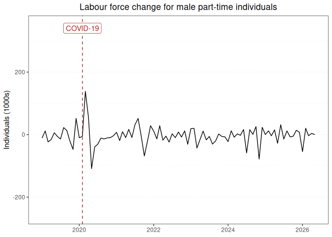

Labour force report for male part-time individuals
================

### Graph of labour force changes since 2019

This report displays the adjusted monthly change in labour force numbers
for male part-time individuals from 2019-01 to 2026-01.

<!-- -->

### Table of labour force numbers and changes in the last 12 months

This table displays the adjusted labour force numbers and adjusted
change in labour force numbers for male part-time individuals from
2025-03 to 2026-01.

| year | month |   number | ingested_on |     change |
|-----:|------:|---------:|:------------|-----------:|
| 2025 |     3 | 1520.062 | 2026-03-01  |  -3.522976 |
| 2025 |     4 | 1523.585 | 2026-03-01  |  16.988405 |
| 2025 |     5 | 1506.596 | 2026-03-01  | -29.467298 |
| 2025 |     6 | 1536.064 | 2026-03-01  |  33.567372 |
| 2025 |     7 | 1502.496 | 2026-03-01  | -15.329897 |
| 2025 |     8 | 1517.826 | 2026-03-01  |  13.610921 |
| 2025 |     9 | 1504.215 | 2026-03-01  |  -6.968424 |
| 2025 |    10 | 1511.184 | 2026-03-01  |  -5.220127 |
| 2025 |    11 | 1516.404 | 2026-03-01  |  14.975652 |
| 2025 |    12 | 1501.428 | 2026-03-01  |   6.946339 |
| 2026 |     1 | 1494.482 | 2026-03-01  |   0.000000 |

------------------------------------------------------------------------

Report last updated on 2026-03-01 from the [ABS labour force
dataset](https://www.abs.gov.au/statistics/labour/employment-and-unemployment/labour-force-australia/latest-release)
