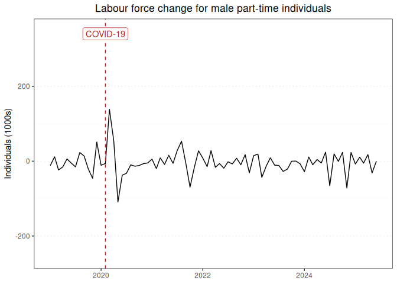

Labour force report for male part-time individuals
================

### Graph of labour force changes since 2019

This report displays the adjusted monthly change in labour force numbers
for male part-time individuals from 2019-01 to 2023-01.

<!-- -->

### Table of labour force numbers and changes in the last 12 months

This table displays the adjusted labour force numbers and adjusted
change in labour force numbers for male part-time individuals from
2022-03 to 2023-01.

| year | month |   number | ingested_on |     change |
|-----:|------:|---------:|:------------|-----------:|
| 2022 |     3 | 1318.978 | 2023-03-01  |  32.328198 |
| 2022 |     4 | 1286.649 | 2023-03-01  | -18.776820 |
| 2022 |     5 | 1305.426 | 2023-03-01  |  -2.416762 |
| 2022 |     6 | 1307.843 | 2023-03-01  | -20.852962 |
| 2022 |     7 | 1328.696 | 2023-03-01  |  -2.349743 |
| 2022 |     8 | 1331.046 | 2023-03-01  | -10.757668 |
| 2022 |     9 | 1341.803 | 2023-03-01  |   5.937696 |
| 2022 |    10 | 1335.866 | 2023-03-01  |  -2.547549 |
| 2022 |    11 | 1338.413 | 2023-03-01  |  22.086959 |
| 2022 |    12 | 1316.326 | 2023-03-01  | -36.485987 |
| 2023 |     1 | 1352.812 | 2023-03-01  |   0.000000 |

------------------------------------------------------------------------

Report last updated on 2023-03-01 from the [ABS labour force
dataset](https://www.abs.gov.au/statistics/labour/employment-and-unemployment/labour-force-australia/latest-release)
